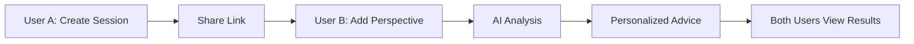

# 💝 Bondly - AI-Powered Relationship Counseling

<div align="center">
  
  
  
  
  
</div>

<br />

A modern web application that helps couples work through relationship challenges by collecting both perspectives and providing personalized AI-powered advice.

## ✨ Features

- 🔐 **Anonymous Sessions** - No account required to start
- 💬 **Dual Perspectives** - Both partners share their views independently
- 🤖 **AI-Powered Advice** - Personalized guidance using Google Gemini
- 💡 **Action Steps** - Concrete steps to improve the situation
- 🗣️ **Conversation Starters** - Prompts to facilitate healthy dialogue
- 📊 **Session History** - Track your relationship journey (with account)
- 🎨 **Beautiful UI** - Modern, responsive design with Tailwind CSS

## 🚀 Quick Start

### Prerequisites

- Node.js 18 or higher
- pnpm (`npm install -g pnpm`)
- Supabase account (free tier)
- Google AI API key (free)

### Installation

1. **Clone and install**
   ```bash
   pnpm install
   ```

2. **Setup Supabase**
   - Create a project at [supabase.com](https://app.supabase.com)
   - Run the SQL script in `scripts/001_create_tables.sql`
   - Enable "Anonymous sign-ins" in Authentication > Providers
   - Get your Project URL and anon key from Settings > API

3. **Get Google AI API Key**
   - Visit [Google AI Studio](https://aistudio.google.com/apikey)
   - Create and copy your API key

4. **Configure environment variables**
   ```bash
   cp .env.local.example .env.local
   # Edit .env.local with your keys
   ```

5. **Run the development server**
   ```bash
   pnpm dev
   ```

6. **Open [http://localhost:3000](http://localhost:3000)**

For detailed setup instructions, see [SETUP.md](./SETUP.md)

## 🏗️ How It Works



1. **Partner 1** creates a session describing their perspective
2. They share a unique link with **Partner 2**
3. **Partner 2** adds their perspective
4. AI analyzes both sides and generates personalized advice
5. Each partner receives tailored guidance, action steps, and conversation starters

## 📁 Project Structure

```
bondly/
├── app/
│   ├── api/
│   │   └── analyze-session/     # AI analysis endpoint
│   ├── auth/                    # Login & sign-up pages
│   ├── dashboard/               # Session history
│   ├── session/
│   │   ├── new/                 # Create session
│   │   └── [id]/
│   │       ├── share/           # Share link page
│   │       ├── processing/      # AI processing status
│   │       └── advice/          # View advice
│   └── partner/[token]/         # Partner response page
├── components/
│   ├── ui/                      # shadcn/ui components
│   └── copy-button.tsx          # Custom components
├── lib/
│   ├── supabase/               # Supabase clients
│   ├── types.ts                # TypeScript types
│   └── utils.ts                # Utility functions
├── scripts/
│   └── 001_create_tables.sql   # Database schema
└── public/                      # Static assets
```

## 🛠️ Tech Stack

- **Framework**: Next.js 16 (App Router)
- **Language**: TypeScript 5
- **Styling**: Tailwind CSS 4
- **UI Components**: shadcn/ui (Radix UI)
- **Database**: Supabase (PostgreSQL)
- **Authentication**: Supabase Auth
- **AI**: Vercel AI SDK + Google Gemini 2.0
- **Package Manager**: pnpm

## 🗄️ Database Schema

### Tables

- **sessions**: Stores session metadata and status
  - `id`, `creator_id`, `creator_name`, `partner_name`, `status`, `share_token`
  
- **responses**: Stores each partner's perspective
  - `id`, `session_id`, `user_id`, `is_creator`, `situation_description`, `feelings`, `emotional_state`
  
- **advice**: Stores AI-generated advice
  - `id`, `session_id`, `user_id`, `is_creator`, `advice_text`, `conversation_starters`, `action_steps`

### Row Level Security (RLS)

All tables have RLS policies to ensure users can only access their own data.

## 🔒 Security Features

- ✅ Anonymous authentication supported
- ✅ Row Level Security (RLS) enabled
- ✅ Server-side auth checks
- ✅ Secure session tokens
- ✅ Environment variables for sensitive data

## 🚀 Deployment

### Vercel (Recommended)

1. Push your code to GitHub
2. Import project in [Vercel](https://vercel.com)
3. Add environment variables:
   - `NEXT_PUBLIC_SUPABASE_URL`
   - `NEXT_PUBLIC_SUPABASE_ANON_KEY`
   - `NEXT_PUBLIC_SITE_URL`
   - `GOOGLE_GENERATIVE_AI_API_KEY`
4. Deploy!

### Other Platforms

```bash
# Build the app
pnpm build

# Start production server
pnpm start
```

Ensure all environment variables are set in your hosting platform.

## 📝 Environment Variables

Create a `.env.local` file:

```bash
# Supabase
NEXT_PUBLIC_SUPABASE_URL=your_supabase_url
NEXT_PUBLIC_SUPABASE_ANON_KEY=your_supabase_anon_key

# Site URL
NEXT_PUBLIC_SITE_URL=http://localhost:3000

# Google AI
GOOGLE_GENERATIVE_AI_API_KEY=your_google_ai_key
```

## 🐛 Troubleshooting

### Common Issues

**"Failed to create session"**
- Enable anonymous sign-ins in Supabase (Authentication > Providers)
- Check environment variables are set

**"Failed to analyze session"**
- Verify Google AI API key is valid
- Check that both responses were submitted

**Database errors**
- Run the SQL script in `scripts/001_create_tables.sql`
- Check Supabase connection

### Debug Mode

Check the browser console and terminal for detailed error messages. All errors are prefixed with `[v0]`.

## 📚 API Routes

### POST `/api/analyze-session`

Triggers AI analysis of a completed session.

**Request:**
```json
{
  "sessionId": "uuid"
}
```

**Response:**
```json
{
  "success": true
}
```

## 🎨 Customization

### Changing the Theme

Edit `app/globals.css` to customize colors:

```css
:root {
  --primary: oklch(...);
  --rose-500: ...;
}
```

### Adding Emotions

Edit the emotions array in:
- `app/session/new/page.tsx`
- `app/partner/[token]/page.tsx`

### Modifying AI Prompts

Edit the prompt in `app/api/analyze-session/route.ts` > `generateAdvice()`

## 🤝 Contributing

This is a personal project, but feel free to fork and adapt it for your needs!

## 📄 License

MIT License - feel free to use this project for personal or commercial purposes.

## 💡 Credits

Built with [v0](https://v0.dev) and powered by:
- Next.js team for the amazing framework
- Supabase for the backend
- Vercel for AI SDK
- shadcn for the beautiful UI components
- Google for Gemini AI

---

<div align="center">
  Made with ❤️ for better relationships
</div>

